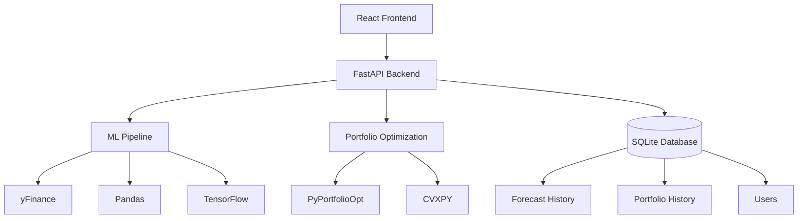
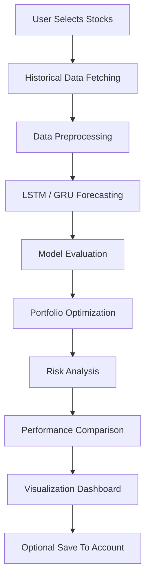
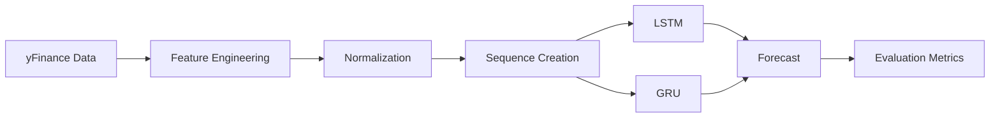

# Invest Infinity

### AI-Powered Stock Forecasting & Portfolio Optimization Platform (Ongoing)

Invest Infinity is a full-stack financial analytics platform that combines **Deep Learning**, **Portfolio Optimization**, **Risk Analysis** and **Interactive Visualization** to help investors make data-driven investment decisions.

The project evolved through three major versions:

---

# IMPORTANT LINKS

## Version 1 (Deep Learning Research Prototype) — Portfolio Optimization using ML & DL
Link : [https://github.com/Saisha0512/Portfolio_Optimization_ML_DL](https://github.com/Saisha0512/Portfolio_Optimization_ML_DL)

## Version 2 (Streamlit Web Application) — Invest_Infinity
Link : [https://github.com/Saisha0512/Invest_Infinity_Streamlit](https://github.com/Saisha0512/Invest_Infinity_Streamlit)

---

# PROJECT EVOLUTION

## Version 1 — Deep Learning Research Prototype

The initial version focused purely on stock forecasting using Deep Learning models.

### Features

- Historical stock data collection using Yahoo Finance
- Data preprocessing and normalization
- LSTM forecasting model
- GRU forecasting model
- Model evaluation
- Forecast visualization

### Environment

- Google Colab
- Python
- TensorFlow
- Keras
- Pandas
- NumPy
- Matplotlib

### Outputs

- Forecasted stock prices
- RMSE
- MAE
- MAPE
- R² Score
- Model comparison graphs

---

## Version 2 — Streamlit Web Application

The second version transformed the forecasting notebook into an interactive web application.

### Features

- Upload/select stocks
- Choose forecasting horizon
- Select forecasting model
- Visualize forecasts
- Portfolio optimization
- Risk metrics dashboard

### Technology

- Streamlit
- TensorFlow
- Pandas
- PyPortfolioOpt

### Limitations

- Monolithic architecture
- Limited scalability
- Minimal backend separation
- Basic UI

---

## Version 3 — Full Stack Platform (Current)

The current version redesigns the project into a scalable full-stack architecture.

### Key Improvements

- React frontend
- FastAPI backend
- Modular ML pipeline
- Portfolio optimization module
- Database support
- Authentication support
- Cloud deployment ready
- Professional dashboard

---

# PROJECT OBJECTIVES

Invest Infinity helps investors answer questions such as:

- Which stocks should I invest in?
- How are stock prices expected to move?
- Which forecasting model performs better?
- How should I allocate my capital?
- What level of risk am I taking?
- Which portfolio offers the best risk-return tradeoff?

---

# CORE FEATURES

## Deep Learning Forecasting

Uses:

- LSTM
- GRU

Provides:

- Future price prediction
- Model comparison
- Forecast visualization

---

## Portfolio Optimization

Uses:

- PyPortfolioOpt
- CVXPY

Generates:

- Maximum Sharpe Portfolio
- Minimum Volatility Portfolio
- Optimal Asset Allocation

---

## Risk Analytics

Calculates:

- Expected Return
- Volatility
- Sharpe Ratio
- Value at Risk (VaR)
- Conditional Value at Risk (CVaR)

---

## Dashboard

Provides:

- Forecast Charts
- Allocation Charts
- Risk Analytics
- Performance Comparison
- Historical Results

---

## User Accounts (Version 3)

### Guest Users

Can:

- Forecast stocks
- Optimize portfolios
- View analytics

Without creating an account.

### Registered Users

Can:

- Save forecasts
- Save portfolio allocations
- View forecast history
- View portfolio history

---

# SYSTEM ARCHITECTURE



---

# PROJECT WORKFLOW



---

# FORECASTING WORKFLOW



---

# REPOSITORY STRUCTURE (Proposed - Still Ongoing)

```text
Invest-Infinity/
│
├── README.md
├── architecture.md
├── requirements.txt
├── .gitignore
│
├── frontend/
│
├── backend/
│
├── ml/
│
├── optimization/
│
├── database/
│
├── data/
│
├── docs/
│
└── deployment/
```

---

# FRONTEND

```text
frontend/
│
├── public/
│
├── src/
│
├── components/
│
├── pages/
│
├── services/
│
├── hooks/
│
└── utils/
```

### Technology

- React
- TypeScript
- Tailwind CSS
- ShadCN UI
- Recharts
- React Router

---

# BACKEND

```text
backend/
│
├── app/
│   ├── api/
│   ├── schemas/
│   ├── services/
│   ├── database/
│   └── utils/
│
└── requirements.txt
```

### Technology

- FastAPI
- Pydantic
- SQLAlchemy
- SQLite

---

# MACHINE LEARNING & DEEP LEARNING MODULE

```text
ml/
│
├── data/
│
├── models/
│
├── evaluation/
│
└── saved_models/
```

### Data Pipeline

- Data Collection
- Preprocessing
- Feature Engineering
- Training
- Prediction
- Evaluation

### Deep Learning Models

- LSTM
- GRU

### Evaluation Metrics

- RMSE
- MAE
- MAPE
- R²

---

# PORTFOLIO OPTIMIZATION MODULE

```text
optimization/
│
├── optimizer.py
├── efficient_frontier.py
├── portfolio_allocator.py
├── risk_metrics.py
└── backtesting.py
```

### Optimization Techniques

- Modern Portfolio Theory
- Efficient Frontier
- Maximum Sharpe Ratio
- Minimum Volatility

---

# DATABASE

```text
database/
│
└── invest_infinity.db
```

Stores:

- Users
- Forecast History
- Portfolio History
- Model Metrics

---

# TECH STACK

## Frontend

| Technology | Purpose |
|------------|----------|
| React | UI Development |
| TypeScript | Type Safety |
| Tailwind CSS | Styling |
| ShadCN UI | Components |
| Recharts | Visualization |

---

## Backend

| Technology | Purpose |
|------------|----------|
| FastAPI | REST APIs |
| Pydantic | Validation |
| SQLAlchemy | ORM |
| SQLite | Storage |

---

## Machine Learning

| Technology | Purpose |
|------------|----------|
| yFinance | Stock Data |
| Pandas | Processing |
| NumPy | Computation |
| Scikit-Learn | Scaling & Metrics |
| TensorFlow | Deep Learning |
| Keras | LSTM & GRU |
| Joblib | Model Persistence |

---

## Optimization

| Technology | Purpose |
|------------|----------|
| PyPortfolioOpt | Portfolio Optimization |
| CVXPY | Optimization Solver |

---

# DEPLOYMENT

Frontend:

- Vercel

Backend:

- Render

Database:

- SQLite (Development)
- PostgreSQL (Future Upgrade)

---

# FUTURE ENHANCEMENTS

## Forecasting

- Transformer Models
- Attention Mechanisms
- Ensemble Forecasting
- Multi-stock Forecasting

## Portfolio

- Black-Litterman Model
- Risk Parity
- Dynamic Rebalancing

## Backend

- JWT Authentication
- Redis Caching
- Background Tasks

## Dashboard

- Real-time Market Data
- Watchlists
- Alerts & Notifications
- Export Reports

---

# PROJECT CONTRIBUTORS

- **Saisha Verma** [@Saisha0512](https://github.com/Saisha0512)
- **Ritisha Sood** [@RitishaSood](https://github.com/RitishaSood/)

---

# LICENSE

This project is developed for educational, research and portfolio purposes.

The forecasts and optimization results generated by this platform are not financial advice.

Always perform independent research before making investment decisions.
